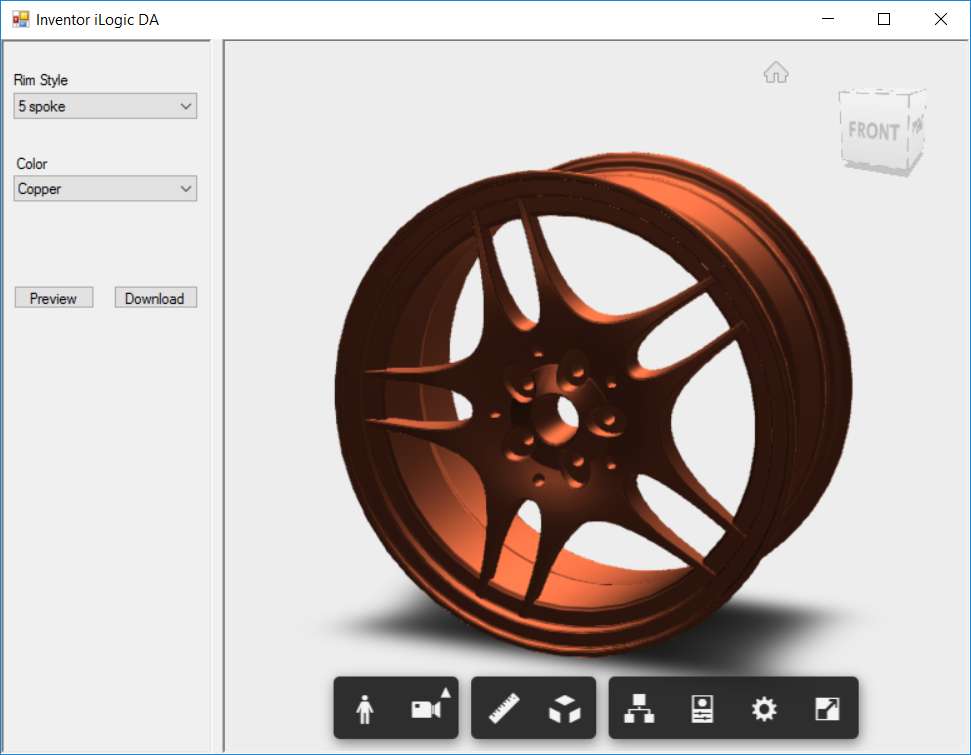

# Inventor Design Automation with iLogic

# Description

 This sample is a .NET standalone application that demonstrates the use of Inventor Design Automation along with iLogic capabilities.
 It launches a UI that allows the user to select the desired configuration and then preview it in the Viewing Pane. The user also has the option to download it to his local drive as an Inventor Part file (.ipt).
 
 This sample contains the Inventor addin project as well as the input part file which contains the iLogic code which is automatically triggered when the parameters are changed using Design Automation for Inventor.
 ## Thumbnail

 # Setup

## Prerequisites
1. Create a Forge account, as you will need the key and secret for running the app. Refer this [tutorial](http://learnforge.autodesk.io/#/account/) for more details.
2. Inventor 2019 API's: Required to make any modifications to the plugin if required.
3. Visual Studio
4. knowledge of C#

## Running locally
1. Clone or download this project.
2. Add to your env. variables
    * FORGE_CLIENT_ID
    * FORGE_CLIENT_SECRET
3. Build and run the solution
4. Select the desired options and click on Preview. The result model would then be displayed in the Viewing Pane. Click on Download to download the file to local drive. The file is saved to the current user's Documents folder by default.

# Further Reading

- [Design Automation v3](https://forge.autodesk.com/en/docs/design-automation/v3/developers_guide/overview/)
- [iLogic](http://help.autodesk.com/view/INVNTOR/2019/ENU/?guid=GUID-AB9EE660-299E-408F-BBE1-AFE44C723F59)

## License

This sample is licensed under the terms of the [MIT License](http://opensource.org/licenses/MIT). Please see the [LICENSE](LICENSE) file for full details.

## Written by

Sajith Subramanian, [Forge Partner Development](http://forge.autodesk.com)
